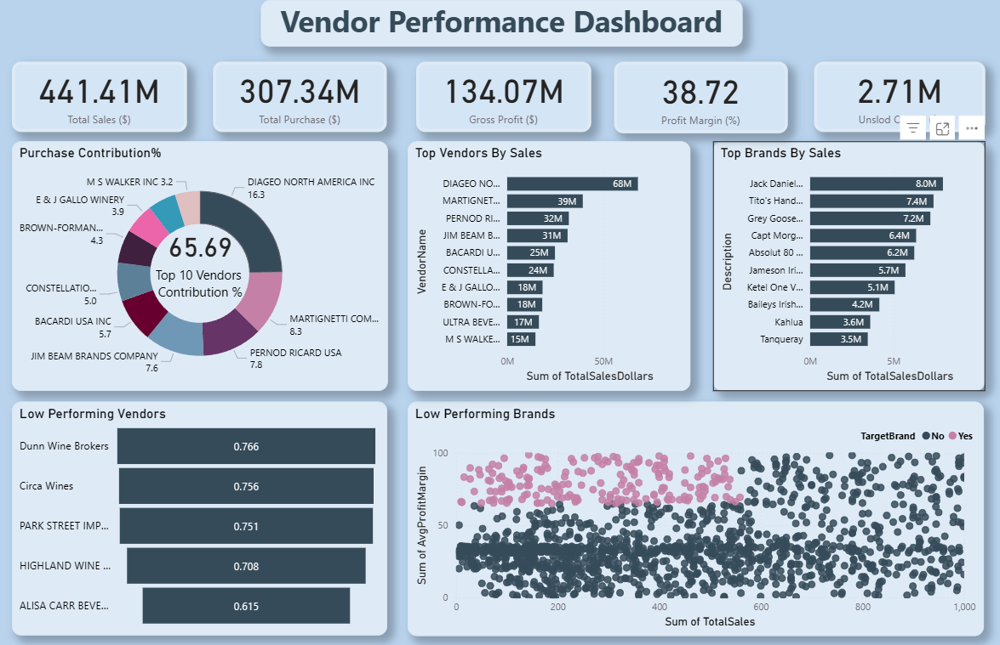

# Vendor Performance & Retail Analytics – Inventory & Sales Insights  

Analyzing vendor performance, sales dynamics, and inventory to guide data-driven procurement, pricing, and promotional strategies using SQL, Python, and Power BI.  

---

## 📌 Table of Contents  
- [Introduction](#introduction)  
- [Problem Statement](#problem-statement)  
- [Dataset](#dataset)  
- [Tech Stack](#tech-stack)  
- [Folder Layout](#folder-layout)  
- [Data Cleaning & Preparation](#data-cleaning--preparation)  
- [Exploratory Data Analysis (EDA)](#exploratory-data_analysis-(EDA))  
- [Insights & Findings](#insights--findings)  
- [Dashboard](#dashboard)  
- [How to Run the Project](#how-to-run-the-project)  
- [Recommendations](#recommendations)  
- [Contact](#contact)  

---

## Introduction  
This project investigates **vendor efficiency and inventory movement** in retail, to drive strategic insights for purchasing, pricing, and inventory optimization. A complete data pipeline was built using SQL for ETL, Python for analysis and hypothesis testing, and Power BI for visualization.

---

## Problem Statement  
In retail, managing vendors and inventory directly impacts profitability.  
The key questions addressed were:  
- Which vendors consistently underperform?  
- How much do vendors contribute to sales and profits?  
- What are the cost structures and purchasing patterns?  
- Are there significant differences in vendor profitability?  

---

## Dataset  
- Raw data in CSV files (sales, vendors, inventory).  
- Summary table created from ingested data and used for analysis  

---

## Tech Stack  
- **SQL** (Joins, CTEs, Filtering
- )  
- **Python** (Pandas, Matplotlib, Seaborn)  
- **Power BI** (Dashboard & KPIs)  
- **GitHub** (Version control)  

---

## Folder Layout  
```
vendor-performance-analysis/
│── scripts/             # Python scripts for ingestion and processing
|   ├── ingestion_db.py
│   └── get_vendor_summary.py
|
│── notebooks/           # Exploratory analysis
│   ├── exploratory_data_analysis.ipynb
│   ├── vendor_performance_analysis.ipynb
|
│── dashboards/          # Power BI dashboards
│   └── vendor_performance_dashboard.pbix
│── README.md
├── .gitignore
├── Vendor Performance Report.pdf
```

---

## Data Cleaning & Preparation  
- - Removed transactions with:
  - Gross Profit ≤ 0
  - Profit Margin ≤ 0
  - Sales Quantity = 0
- Created summary tables with vendor-level metrics
- Converted data types, handled outliers, merged lookup tables 

---

## Exploratory Data Analysis (EDA)
**Negative or Zero Values Detected:**
- Gross Profit: Min -52,002.78 (loss-making sales)
- Profit Margin: Min -∞ (sales at zero or below cost)
- Unsold Inventory: Indicating slow-moving stock

**Outliers Identified:**
- High Freight Costs (up to 257K)
- Large Purchase/Actual Prices

**Correlation Analysis:**
- Weak between Purchase Price & Profit
- Strong between Purchase Qty & Sales Qty (0.999)
- Negative between Profit Margin & Sales Price (-0.179)

---

## Insights & Findings  
1. **Brands for Promotions**: 198 brands with low sales but high profit margins
2. **Top Vendors**: Top 10 vendors = 65.69% of purchases → risk of over-reliance
3. **Bulk Purchasing Impact**: 72% cost savings per unit in large orders
4. **Inventory Turnover**: $2.71M worth of unsold inventory
5. **Vendor Profitability**:
   - High Vendors: Mean Margin = 31.17%
   - Low Vendors: Mean Margin = 41.55%
6. **Hypothesis Testing**: Statistically significant difference in profit margins → distinct vendor strategies.

---

## Dashboard  
Interactive **Power BI dashboard** with:  
- Vendor sales & margins  
- Inventory turnover  
- Bulk vs retail purchase comparison  
- Vendor profitability  



---

## How to Run the Project  
1. Clone the repository:
```bash
git clone https://github.com/JatinMukati/vendor-performance-analysis.git
```

3. Load the CSVs and ingest into database:
```bash
python scripts/ingestion_db.py
```

4. Create vendor summary table:
```bash
python scripts/get_vendor_summary.py
```

5. Open and run notebooks:
   - `notebooks/exploratory_data_analysis.ipynb`
   - `notebooks/vendor_performance_analysis.ipynb`

6. Open Power BI Dashboard:
   - `dashboard/vendor_performance_dashboard.pbix`
 

---

## Recommendations  
- Diversify vendor portfolio to reduce dependency.  
- Negotiate better pricing from low-margin vendors.  
- Clear non-moving inventory quickly.  
- Focus marketing spend on profitable vendors.  

---

## Contact  
👤 **Jatin Mukati**  
Data Analyst  
📧 Email: techclasses0810@gmail.com  
🔗 [LinkedIn](https://www.linkedin.com/in/jatinmukati/)  
🔗 [Portfolio](https://jatinmukati.vercel.app/)
